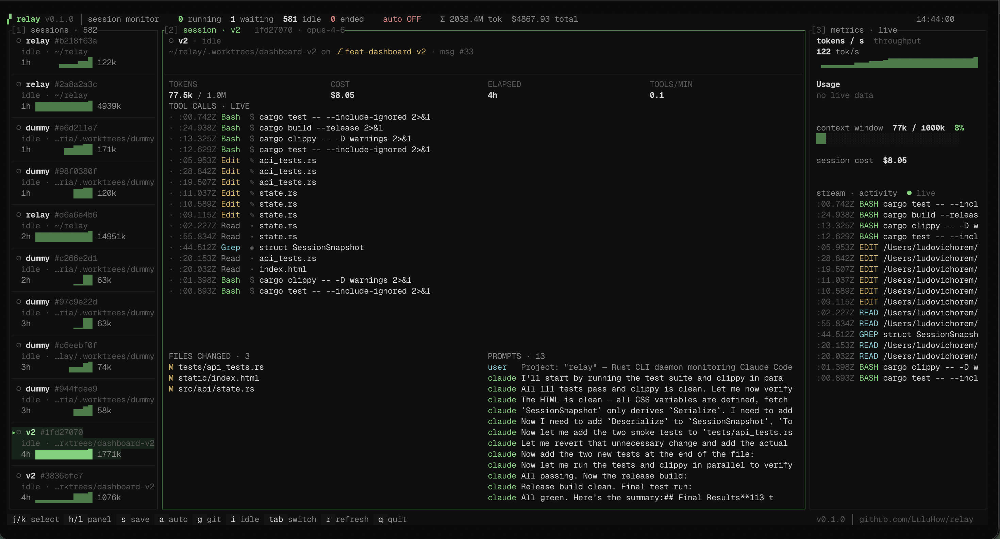
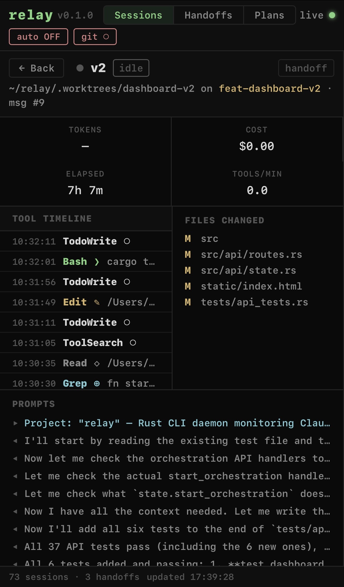

# relay



CLI daemon that monitors [Claude Code](https://docs.anthropic.com/en/docs/claude-code) sessions and generates structured handoffs to preserve context across session boundaries.

When Claude Code approaches its context limit, relay saves the session state as a markdown handoff, optionally kills the session, and restarts it with the handoff injected — so you never lose your thread.

## Features

- **Real-time TUI** — monitor all active Claude Code sessions (context %, tokens, model, cost)
- **Web dashboard** — browser-based GUI with the same capabilities, accessible remotely
- **Auto-handoff** — detects context saturation, saves state, kills & restarts with continuity
- **Structured handoffs** — goal, current focus, last assistant state, recent tools, files touched
- **Git auto-commit** — commits work before handoff so nothing is lost
- **Hook integration** — installs Claude Code hooks (Stop, statusLine) automatically
- **Shell wrapper** — transparent `claude` wrapper that handles restart loops
- **Multi-task orchestration** — decompose work into a plan, run tasks sequentially with dependency resolution
- **Discord / Slack notifications** — webhook alerts on every handoff

## Install

### One-liner

```bash
curl -fsSL https://raw.githubusercontent.com/LuluHow/relay/main/install.sh | bash
```

### From source

```bash
git clone https://github.com/LuluHow/relay.git
cd relay
cargo build --release
mkdir -p ~/.local/bin
cp target/release/relay ~/.local/bin/

# Ensure ~/.local/bin is in your PATH
export PATH="$HOME/.local/bin:$PATH"

relay init
```

Then add to your shell rc file (`~/.zshrc` or `~/.bashrc`):

```bash
export PATH="$HOME/.local/bin:$PATH"
source ~/.relay/claude-wrapper.sh
```

### From GitHub releases

Download the binary for your platform from [Releases](https://github.com/LuluHow/relay/releases), then:

```bash
chmod +x relay
mkdir -p ~/.local/bin
mv relay ~/.local/bin/
export PATH="$HOME/.local/bin:$PATH"
relay init
# Add export PATH and source lines as shown above
```

## Usage

```bash
relay                                  # Launch TUI (default)
relay serve                            # Start web dashboard + API server
relay status                           # Show active sessions
relay save                             # Save handoff for most recent session
relay list                             # List saved handoffs
relay restore <id>                     # Print handoff to stdout
relay orchestrate plan.toml            # Run multi-task orchestration
relay orchestrate --create-plan        # Create a plan interactively
relay init                             # Create config + shell wrapper
relay test-notify                      # Test Discord/Slack webhook notifications
relay tunnel                           # Print instructions for remote access
relay uninstall                        # Remove all traces of relay
relay --version                        # Show version
```

## TUI

The default interface. Launch with `relay` (no arguments).

### Keybindings

| Key | Action |
|-----|--------|
| `j/k` or `↑/↓` | Navigate sessions |
| `Tab` | Switch between Sessions / Handoffs tabs |
| `s` | Save handoff for selected session |
| `d` | Toggle detail/dashboard view |
| `a` | Toggle auto-handoff |
| `g` | Toggle git auto-commit |
| `i` | Toggle idle sessions visibility |
| `r` | Refresh |
| `1/2` | Jump to Sessions/Handoffs tab |
| `q` | Quit |

## Web dashboard

> **Experimental** — The web dashboard is still under active development. Expect rough edges and occasional bugs. Feedback and bug reports are very welcome — open an issue on [GitHub](https://github.com/LuluHow/relay/issues).

The web dashboard provides the same monitoring and control capabilities as the TUI, accessible from any browser. It includes real-time session monitoring, handoff management, config toggles (auto-handoff, auto-commit), and orchestration controls. Works on desktop and mobile.

<p align="center">
  
</p>

Toggle states are synced between TUI and web dashboard — changing auto-handoff in one is reflected in the other.

### Starting the server

```bash
# Start on default port (4747), localhost only
relay serve

# Custom port and bind address
relay serve --port 8080 --bind 0.0.0.0

# With authentication (recommended for remote access)
relay serve --token my-secret-token
```

Then open `http://localhost:4747` in your browser.

### Configuration

Server settings can also be set in `~/.relay/config.toml`:

```toml
api_port = 4747
api_bind = "127.0.0.1"
api_token = "your-secret-token"
```

### Remote access with Tailscale

[Tailscale](https://tailscale.com) is the easiest way to access relay from another device (phone, laptop, tablet) without exposing it to the public internet.

1. Install Tailscale on both your server machine and your client device
2. Bind relay to your Tailscale interface:
   ```bash
   relay serve --bind 0.0.0.0 --token my-secret-token
   ```
3. Find your machine's Tailscale IP:
   ```bash
   tailscale ip -4
   # e.g. 100.64.1.42
   ```
4. Open `http://100.64.1.42:4747` from any device on your Tailnet

When connecting remotely, the dashboard prompts for your API token automatically.

### Remote access with Cloudflare Tunnel

For public access without opening ports:

```bash
relay tunnel                           # Print setup instructions
cloudflared tunnel --url http://127.0.0.1:4747
```

## Configuration

Config lives at `~/.relay/config.toml`:

```toml
# Auto-handoff: monitor, save, kill, restart
auto_handoff = false

# Context % to trigger handoff
threshold = 20

# Max conversation turns before handoff (0 = disabled)
max_turns = 0

# Poll interval in seconds
interval = 10

# Pause before restart in seconds
cooldown = 5

# Desktop notification on handoff
notify = true

# Git auto-commit when Claude finishes a turn
auto_commit = false

# Auto-commit before handoff
commit_before_handoff = true

# Prefix for auto-commit messages
commit_prefix = "relay"

# Terminal bell on handoff / auto-commit
sound = true

# Discord webhook URL for handoff notifications (optional)
# discord_webhook = "https://discord.com/api/webhooks/..."

# Slack webhook URL for handoff notifications (optional)
# slack_webhook = "https://hooks.slack.com/services/..."

# Workspace directories for the plan wizard project selector
# Only projects within these directories will appear in the dropdown
# If empty, all discovered projects are shown
# workspaces = ["/Users/me/projects", "/Users/me/work"]

# Web dashboard / API settings
# api_port = 4747
# api_bind = "127.0.0.1"
# api_token = "your-secret-token"
```

### Webhook notifications (Discord / Slack)

relay can send a message to Discord or Slack whenever a handoff is triggered.

**Discord setup:**
1. In your Discord server, go to **Server Settings > Integrations > Webhooks**
2. Click **New Webhook**, choose a channel, copy the URL
3. Add to config:
   ```toml
   discord_webhook = "https://discord.com/api/webhooks/..."
   ```

**Slack setup:**
1. Create an [Incoming Webhook](https://api.slack.com/messaging/webhooks) for your workspace
2. Copy the webhook URL
3. Add to config:
   ```toml
   slack_webhook = "https://hooks.slack.com/services/..."
   ```

**Test your setup:**
```bash
relay test-notify
```

## Multi-task orchestration

Relay can orchestrate multiple Claude Code sessions sequentially from a plan file. Each task runs in an isolated git worktree, and the results are merged or submitted as a PR when done.

### Quick start

```bash
# Create a plan interactively
relay orchestrate --create-plan

# Or create a plan interactively with a custom output path
relay orchestrate --create-plan -o my-plan.toml

# Run an existing plan
relay orchestrate plan.toml
```

### Plan format (`plan.toml`)

```toml
[plan]
name = "api-build"
branch = "feat/api"             # git branch for the worktree
model = "claude-sonnet-4-6"     # default model for all tasks (optional)
on_complete = "pr"              # manual | merge | pr
skip_permissions = false        # skip Claude permission prompts (use with caution)

[[tasks]]
name = "init"
prompt = "Initialize Express.js project with TypeScript"

[[tasks]]
name = "routes"
prompt = "Create REST API routes for /users and /posts"
depends_on = ["init"]
model = "claude-sonnet-4-6"     # override model for this task (optional)

[[tasks]]
name = "tests"
prompt = "Write integration tests for all routes"
depends_on = ["routes"]
allowed_tools = "Read,Grep,Edit,Write,Bash"  # restrict available tools (optional)
```

### How it works

1. Relay creates a git worktree (`.worktrees/<plan-name>`) and a new branch
2. Tasks run sequentially — each as a `claude -p` session in the worktree
3. Dependencies are resolved automatically (blocked tasks wait for their deps)
4. If a task fails, all tasks that depend on it are marked as failed too
5. When all tasks complete, relay runs the `on_complete` action:
   - **manual** — branch is ready, checkout and merge when you want
   - **merge** — auto-merges the branch into your current branch
   - **pr** — pushes the branch and creates a GitHub pull request (requires `gh` CLI)
6. The worktree is always cleaned up automatically after completion

### Orchestration TUI

During orchestration, relay displays a dedicated TUI showing task progress:

| Key | Action |
|-----|--------|
| `j/k` or `↑/↓` | Navigate tasks |
| `a` | Abort all tasks |
| `q` | Quit |

### Interactive plan creation

```bash
relay orchestrate --create-plan
```

The wizard prompts for:
- **Plan metadata** — name, branch, model, on_complete, skip_permissions
- **Tasks** — name, prompt (multi-line), model, dependencies, allowed tools
- Validates task names and dependencies as you go

### Claude Code skill

Relay ships a Claude Code skill (`SKILL.md`) that helps decompose complex tasks into orchestration plans. When loaded, Claude can:

- Analyze your codebase and break a large task into ordered sub-tasks
- Generate valid `plan.toml` files with proper dependencies
- Guide you through model selection, `on_complete` strategy, and prompt writing

To use it, reference the skill in your Claude Code configuration or invoke it with `/relay-orchestrate`.

## How it works

```
┌──────────────┐    hooks     ┌───────────────┐
│  Claude Code  │───────────▶│     relay      │
│   (session)   │◀───────────│   (daemon)     │
└──────────────┘  restart    └───────────────┘
                                    │
                              ┌─────┴─────┐
                              │  handoff   │
                              │   (.md)    │
                              └───────────┘
```

1. **relay** installs hooks in Claude Code settings (`Stop`, `statusLine`)
2. Hooks write session events to `~/.relay/events/` and `~/.relay/sessions/`
3. The TUI polls these files + the JSONL session logs
4. When context reaches the threshold, relay:
   - Generates a structured handoff markdown
   - Git-commits uncommitted work (if enabled)
   - Writes the handoff prompt to `~/.relay/next_prompt`
   - Kills the Claude process
5. The shell wrapper detects `next_prompt` and restarts Claude with the handoff

## Platform support

| Platform | Status | Notes |
|----------|--------|-------|
| macOS (Apple Silicon) | Fully supported | Primary development platform |
| macOS (Intel) | Fully supported | |
| Linux (x86_64) | Supported | Uses `/proc` for process detection |
| WSL | Supported | Detected automatically |
| Windows (native) | Not supported | Use WSL |

### Linux notes

- **Notifications** require D-Bus. Build without them: `cargo build --release --no-default-features`
- **Python 3** is required for hooks (Stop, statusLine)
- Process detection uses `/proc` instead of `lsof`

## File structure

```
~/.relay/
├── config.toml              # Configuration
├── overrides.json           # Runtime toggle overrides (synced between TUI and web)
├── claude-wrapper.sh        # Shell wrapper (sourced in .zshrc/.bashrc)
├── statusline-hook.sh       # statusLine hook script
├── hooks/
│   └── stop.sh              # Stop hook script
├── events/                  # Stop event signals
├── sessions/                # Live session status (from statusLine hook)
└── handoffs/                # Saved handoff markdowns
```

## Contributing

AI-assisted contributions are welcome, but **must be disclosed** — mention it in your PR description.

## Acknowledgements

- [abtop](https://github.com/graykode/abtop) — inspiration for terminal-based AI monitoring

## License

MIT
